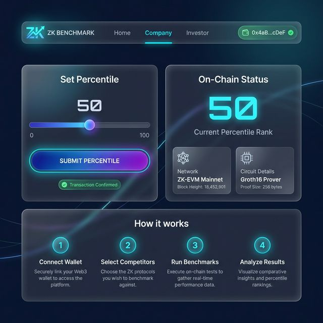
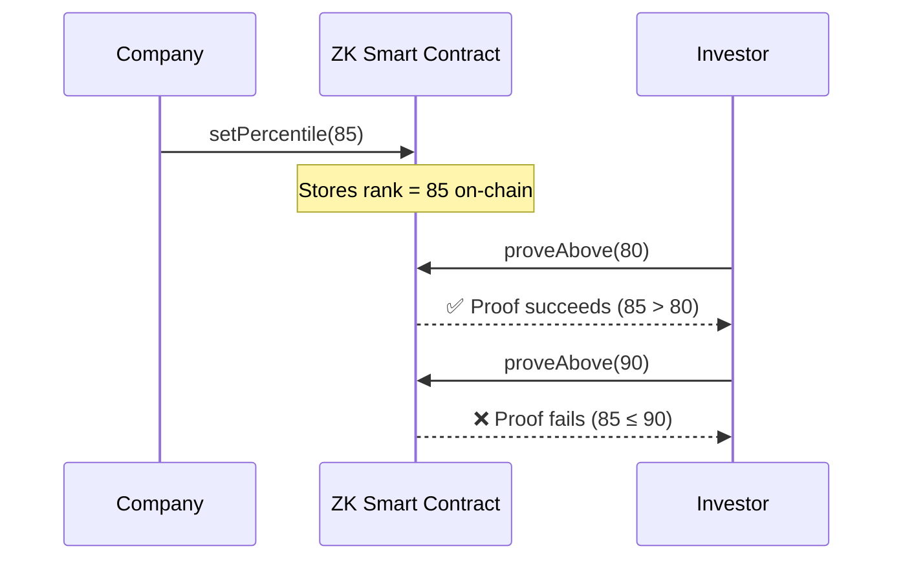

<p align="center">
  <h1 align="center">🔐 ZK Competitor Benchmarking</h1>
  <p align="center">
    <strong>Prove your company's KPIs rank in the top percentile — without revealing the actual numbers.</strong>
  </p>
  <p align="center">
    Built on <a href="https://midnight.network">Midnight Network</a> · Zero-Knowledge Proofs · Privacy-First
  </p>
</p>

<p align="center">
  
</p>

---

## 🧠 What Is This?

**ZK Competitor Benchmarking** lets companies prove their Key Performance Indicators (KPIs) rank within a certain industry percentile to investors — **without exposing raw financial figures to competitors**.

For example, a startup can prove to an investor:

> *"Our revenue growth is in the **top 20%** of the industry"*

...without ever revealing the exact revenue number. This is made possible by **zero-knowledge proofs** on the **Midnight blockchain**.

---

## ✨ Features

| Feature | Description |
|---|---|
| 🔒 **Privacy-Preserving Proofs** | Prove KPI rankings without revealing actual numbers |
| 📊 **Percentile Ranking** | Set and track industry percentile rank (0–100) |
| ✅ **Threshold Verification** | Prove your rank exceeds any given threshold |
| ⛓️ **On-Chain State** | Percentile rank stored on Midnight's public ledger |
| 🧪 **Zero-Knowledge Circuits** | Two ZK circuits: `setPercentile` and `proveAbove` |
| 🚀 **One-Command Deploy** | Simple deployment script with wallet management |

---

## 🏗️ How It Works



The contract uses a **subtraction-underflow pattern** for threshold proofs — if the rank is not above the threshold, the arithmetic underflows, and the proof fails automatically. No raw data is ever leaked.

---

## 📜 Smart Contract

The contract is written in **Compact** (Midnight's ZK smart contract language):

```compact
// Public state: stores percentile rank (0–100)
export ledger percentileRank: Counter;

// Set the company's percentile rank
export circuit setPercentile(value: Uint<16>): [] {
  const disclosed_value = disclose(value);
  percentileRank.increment(disclosed_value);
}

// Prove rank is above a threshold (ZK proof)
export circuit proveAbove(threshold: Field): [] {
  const rank: Field = percentileRank.read();
  const _proof: Field = rank - threshold - 1;
}
```

### Circuits

| Circuit | Purpose | Input |
|---|---|---|
| `setPercentile` | Set the company's industry percentile rank | `value: Uint<16>` (0–100) |
| `proveAbove` | Prove rank exceeds a threshold without revealing the rank | `threshold: Field` |

---

## 🚀 Deployed Contract

| Property | Value |
|---|---|
| **Contract Address** | `c2f18906dd8d928a8b5dbcccb4a16a8670ed890337e2578e18ed320c8840e350` |
| **Network** | `undeployed` (local Midnight network) |
| **Deployed At** | `2026-02-14` |

---

## 📦 Prerequisites

Before you begin, make sure you have installed:

- [Node.js](https://nodejs.org/) v23+ & [npm](https://www.npmjs.com/) v11+
- [Docker](https://docs.docker.com/get-docker/)
- [Git LFS](https://git-lfs.com/)
- [Compact Tools](https://docs.midnight.network/relnotes/compact-tools) (Midnight's ZK compiler)

### Install Compact Tools

```bash
curl --proto '=https' --tlsv1.2 -LsSf \
  https://github.com/midnightntwrk/compact/releases/latest/download/compact-installer.sh | sh

compact update +0.27.0
```

### Verify Installation

```bash
node -v          # v23+
npm -v           # v11+
docker -v
compact check    # Should show latest version
```

---

## 📁 Project Structure

```
zk-competitor-benchmarking/
├── src/
│   ├── ZKCompetitorBenchmarking.compact   # 🔐 ZK Smart Contract
│   ├── deploy.ts                          # 🚀 Deployment script
│   └── managed/                           # 📦 Compiled contract artifacts
│       └── zk-competitor-benchmarking/
│           ├── contract/                  # Generated TypeScript bindings
│           ├── keys/                      # ZK proving/verifying keys
│           └── zkir/                      # ZK intermediate representation
├── deployment.json                        # 📋 Deployed contract info
├── package.json
└── tsconfig.json
```

---

## �️ Getting Started

### 1. Install Dependencies

```bash
cd zk-competitor-benchmarking
npm install
```

### 2. Start the Local Network

```bash
# From the project root
npm run setup-standalone
```

### 3. Compile the Contract

```bash
npm run compile
```

### 4. Build & Deploy

```bash
npm run build
npm run deploy
```

The deploy script will:
1. Generate or prompt for a wallet seed
2. Build and sync the wallet
3. Wait for funds (tNight tokens)
4. Register for dust generation (tx fees)
5. Deploy the contract
6. Save the contract address to `deployment.json`

---

## 🔑 Environment Variables

| Variable | Default | Description |
|---|---|---|
| `SEED` | *(prompted)* | Hex seed for wallet (leave blank to generate) |
| `INDEXER_URL` | `http://127.0.0.1:8088/api/v3/graphql` | Indexer GraphQL endpoint |
| `INDEXER_WS_URL` | `ws://127.0.0.1:8088/api/v3/graphql/ws` | Indexer WebSocket endpoint |
| `NODE_URL` | `http://127.0.0.1:9944` | Midnight node RPC URL |
| `PROOF_SERVER_URL` | `http://127.0.0.1:6300` | ZK proof server URL |
| `NETWORK_ID` | `undeployed` | Network identifier |

---

## 💡 Use Cases

- **Startup Fundraising** — Prove revenue growth percentile to VCs without revealing exact revenue
- **Competitive Intelligence** — Share industry ranking without exposing proprietary metrics
- **Regulatory Compliance** — Demonstrate performance thresholds without full financial disclosure
- **Supply Chain** — Prove supplier quality rankings without revealing pricing
- **ESG Reporting** — Verify sustainability metrics rank above industry benchmarks

---

## 🧰 Tech Stack

| Technology | Purpose |
|---|---|
| [Midnight Network](https://midnight.network) | Privacy-preserving blockchain |
| [Compact Language](https://docs.midnight.network) | ZK smart contract language |
| TypeScript | Deployment scripts & tooling |
| Node.js | Runtime environment |

---

## ⚠️ Known Issues

- There's a not-yet-fixed bug in the arm64 Docker image of the proof server
- **Workaround**: Use Bricktower proof server: `bricktowers/proof-server:6.1.0-alpha.6`

---

## 📄 License

Apache-2.0

---

<div align="center">
  <p>Built with ❤️ using <a href="https://midnight.network">Midnight Network</a></p>
  <p><sub>Privacy is not a feature — it's a right.</sub></p>
</div>
# ZK-Competitor-Benchmarking----1
